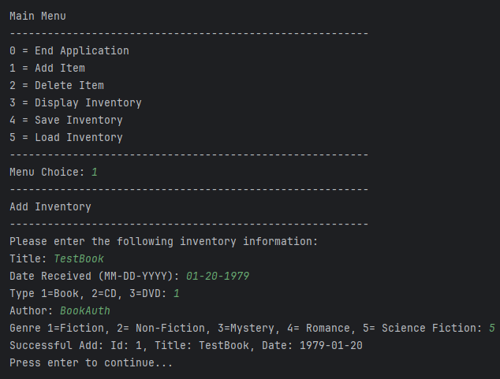
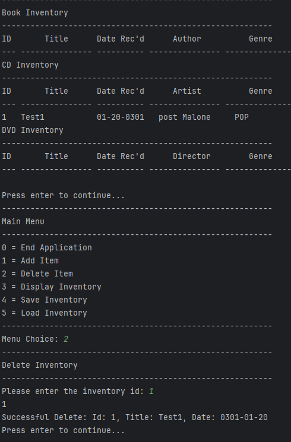
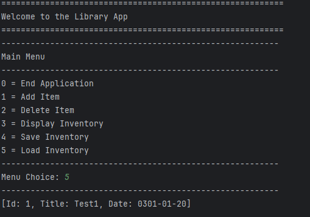

# Library App

<b>Table of Content</b>
- [Summary](#summary)

- [How it Works](#how-it-works)
- [Images of the library](#images-of-the-library).
  - [Adding to the inventory](#adding-to-the-inventory)
  - [Removing from the inventory](#removing-from-the-inventory)
  - [Loading from a file](#Loading-from-a-file)
- [Maintainers](#maintainers)

## Summary
 
## How it Works

[Back to Top](#how-it-works)

## Images of the library

### Adding to the inventory

[Back to Top](#how-it-works)

### Removing from the inventory

[Back to Top](#how-it-works)

### Loading from a file

[Back to Top](#how-it-works)

## Maintainers
[@HunterSchoch](https://github.com/HunterSchoch) Hunter Schoch
[@abelthomas55](https://github.com/abelthomas55) Abel Thomas

[Back to Top](#how-it-works)
