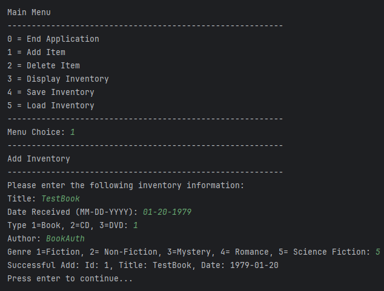
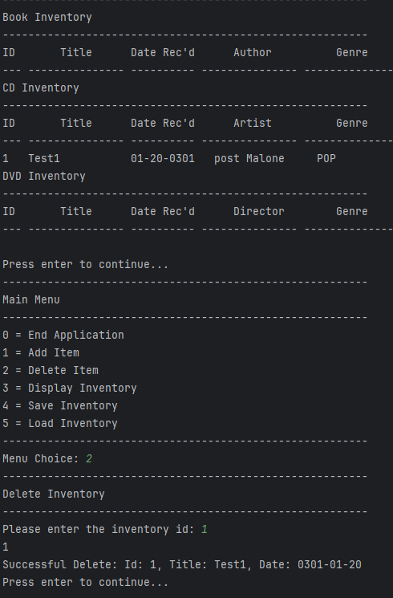
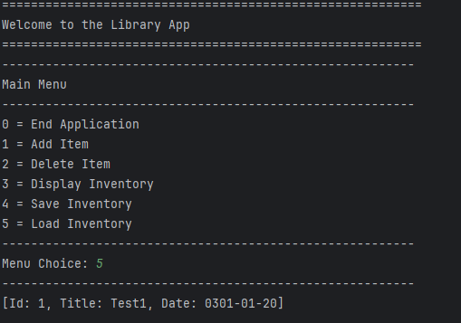

# Library App

<b>Table of Content</b>
- [Summary](#summary)

- [How it Works](#how-it-works)
- [Images of the library](#images-of-the-library).
  - [Adding to the inventory](#adding-to-the-inventory)
  - [Removing from the inventory](#removing-from-the-inventory)
  - [Loading from a file](#Loading-from-a-file)
- [Maintainers](#maintainers)

## Summary
 
## How it Works

This app allows you to create on store inventory items. The 3 Items that are allowed are Books, CDs, and DVDs.
Each Item stores atleast an ID, Title, and Inventry Date. Each subclass then stores specific information pertaining
to the item. So Book would store author and book genre. The inventory is stored in an ArrayList which can be saved to
a file. It then can be loaded in to continue the inventory. 

[Back to Top](#how-it-works)

## Images of the library

### Adding to the inventory

[Back to Top](#how-it-works)

### Removing from the inventory

[Back to Top](#how-it-works)

### Loading from a file

[Back to Top](#how-it-works)

## Maintainers
[@HunterSchoch](https://github.com/HunterSchoch) Hunter Schoch
[@abelthomas55](https://github.com/abelthomas55) Abel Thomas

[Back to Top](#how-it-works)
